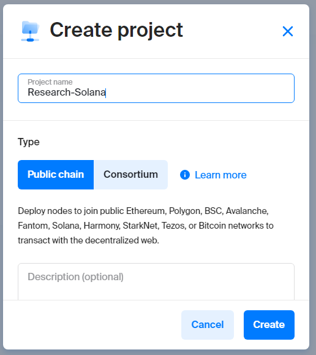
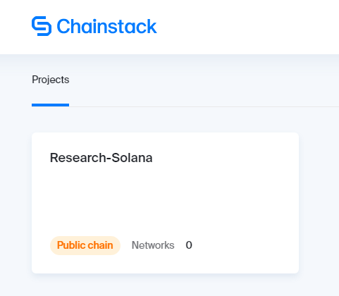
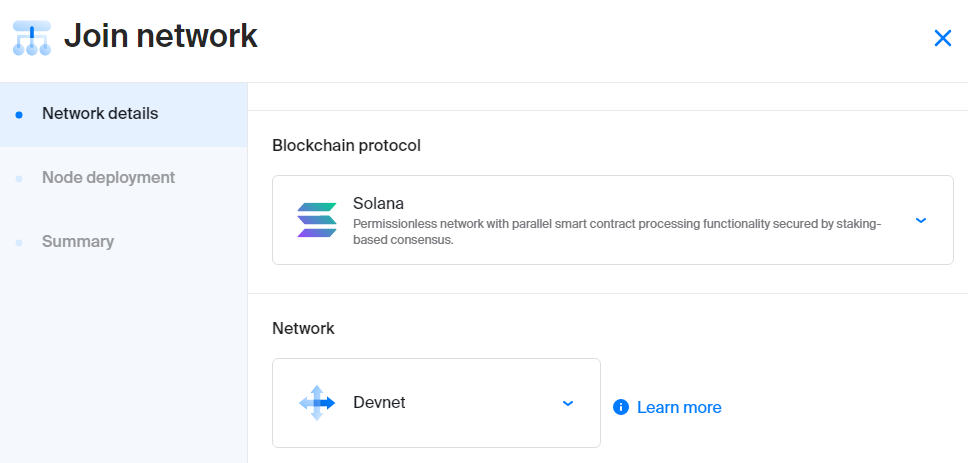
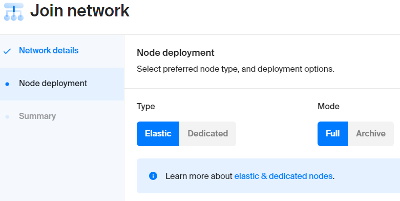
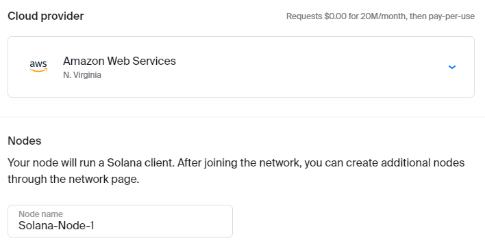
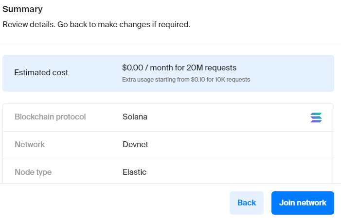
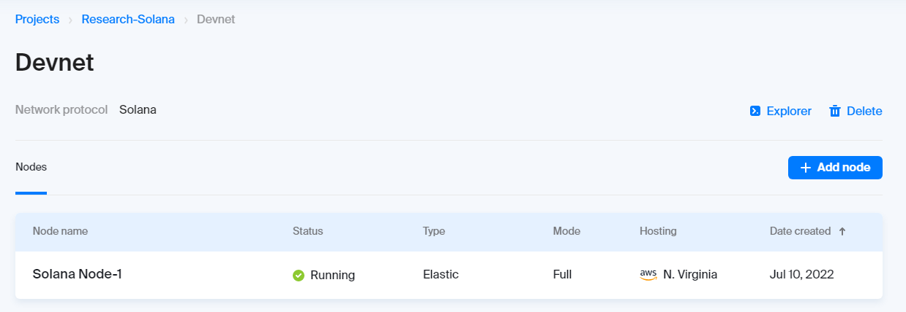
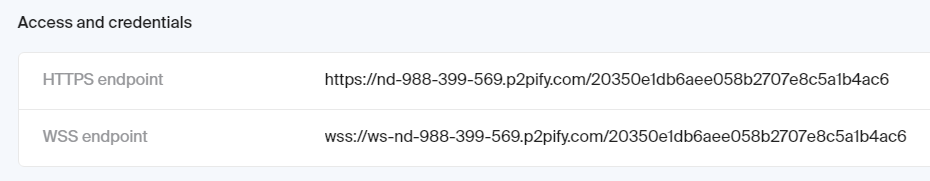
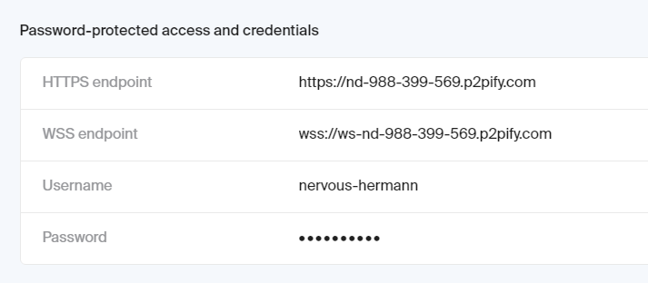

# Mastering Solana

Author : Gun Gun Febrianza


# Table of Contents

- Solana
  - What is Solana
- Solana Wallet
- JSON-RPC
- Development Tools
  - Chainstack
    - Create Solana Node
    - Join to Devnet Network
    - Configure Node Type & Synchronization Mode
    - Pick Cloud Provider
    - Deploy Solana Node
    - Node Access & Credentials
  - Solana Faucet
  - @solana/web3.js
    - Library Abstraction & Classification
- Micro Knowledge
  - @solana/web3.js
  - Install Solana-Web3.js
  - Accessing Keypair Class
- Example Project
  - Airdrop


# Solana

On Solana Blockchain you can create a program.

Program is a codes that run on the Solana blockchain, with program that you deploy and execute on Solana Blockchain you can create a lot of blockchain innovation, for example in the finance industry you can create :

1. Payment Token without a bank
2. Lending System without a bank

It's disrupt and replace on the atomic level of economic activities, because Program on the Solana blockchain replace transaction and agreement from human into transparent algorithm, basically program on the Solana blockchain could replace the middleman in every industries by computer machine.


## What is Solana?

Permissionless network with parallel smart contract processing functionality secured by staking based consensus.


# Solana Wallet

- Public Key = Email
- Secret Key = Password
- Send & Receive SOL = Send/Receive Email


## JSON-RPC 

We can communicate with solana node via HTTP Protocol using the JSON-RPC 2.0 Specification. For javascript developer there is solana-web3.js library, so we can create javascript applications that interact with Solana Node.


JS-Sequence-Diagram :

```
Javascript Apps->Solana Node: Sending HTTP Request
Note right of Solana Node: JSON-RPC 2.0 Specification
Solana Node-->Javascript Apps: Response
```


# Development Tools


## Chainstack

With Chainstack we can create solana node for main-network and development-network (solana sandbox network). So far on chainstack we can deploying elastic solana node with full node mode.


### Create Solana Node 

Go to chainstack dashboard and then click Create Project button, fill the project name, in the type section pick Publick chain and than click Create button.



On the chainstack dashboard, click our new project.




---


## Join to Devnet Network

After you click the project, inside the project click Join network button. In the tab of Network details, there is two information that we need to pick. On the Blockchain protocol you can pick Solana and on the network we will pick Devnet.




---


### Configure Node Type & Sync Mode

Pick elastic node and full mode




---


### Pick Cloud Provider

Next we need to pick Cloud provider to host our node software and through chainstack we create Node name but its only identity that available only on chainstack.




---


### Deploy Solana Node

To deploy solana node click Join Network



You need to wait little bit until the status become running :



When its done, click our node to get Node Access & Credentials.

---


### Node Access & Credentials

We can communicate with the solana node through HTTPS or WebSockets protocol that generated by chainstack.



If we want to communicate with password-protected access and credentials we can use username and password that generated by chainstack.




---


## Solana Faucet

You can get solana faucet here :

https://solfaucet.com/


## @solana/web3.js


## Library Abstraction & Classification

Here is the structure library of @solana/web3.js, just for help to gain quick visualization on the internal modules.


Js-sequence-diagram :

```
flowchart LR
    solana/web3.js --> id1(Enumerations) 
    solana/web3.js --> id2(Classes)
    solana/web3.js --> id3(Interfaces)
    solana/web3.js --> id4(Type Aliases)
    solana/web3.js --> id5(Variables)
    solana/web3.js --> id6(Functions)
```


# Micro Knowledge


## @solana/web3.js


### Install Solana-web3.js


# Example Project


## Airdrop

