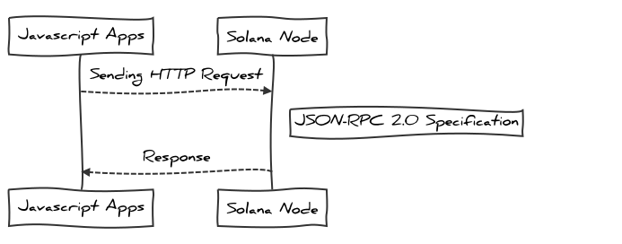

# Mastering Solana

Author : Gun Gun Febrianza


# Solana

On Solana Blockchain you can create a program.

Program is a codes that run on the Solana blockchain, with program that you deploy and execute on Solana Blockchain you can create a lot of blockchain innovation, for example in the finance industry you can create :

1. Payment Token without a bank
2. Lending System without a bank

It's disrupt and replace on the atomic level of economic activities, because Program on the Solana blockchain replace transaction and agreement from human into transparent algorithm, basically program on the Solana blockchain could replace the middleman in every industries by computer machine.


## What is Solana?

Permissionless network with parallel smart contract processing functionality secured by staking based consensus.


# Solana Wallet

- Public Key = Email
- Secret Key = Password
- Send & Receive SOL = Send/Receive Email


## JSON-RPC 

We can communicate with solana node via HTTP Protocol using the JSON-RPC 2.0 Specification. For javascript developer there is solana-web3.js library, so we can create javascript applications that interact with Solana Node.



JS-Sequence-Diagram :

```
Javascript Apps->Solana Node: Sending HTTP Request
Note right of Solana Node: JSON-RPC 2.0 Specification
Solana Node-->Javascript Apps: Response
```


# Development Tools


## Chainstack - Solana Node

With Chainstack we can create solana node for main-network and development-network (solana sandbox network). So far on chainstack we can deploying elastic solana node with full node mode.


## Solana Faucet

You can get solana faucet here :

https://solfaucet.com/


## @solana/web3.js

Here is the structure library of @solana/web3.js, just for help to gain quick visualization on the internal modules.


Js-sequence-diagram :

```
flowchart LR
    solana/web3.js --> id1(Enumerations) 
    solana/web3.js --> id2(Classes)
    solana/web3.js --> id3(Interfaces)
    solana/web3.js --> id4(Type Aliases)
    solana/web3.js --> id5(Variables)
    solana/web3.js --> id6(Functions)
```


# Example Project


## Airdrop

